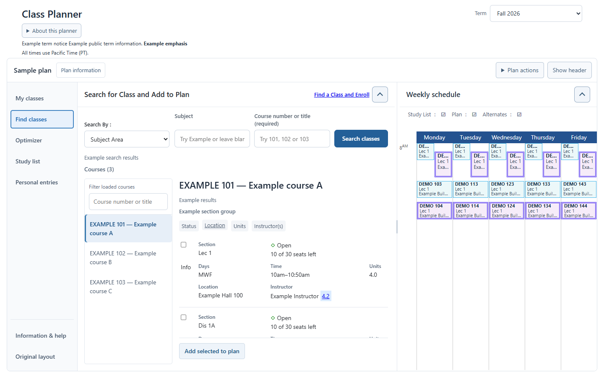
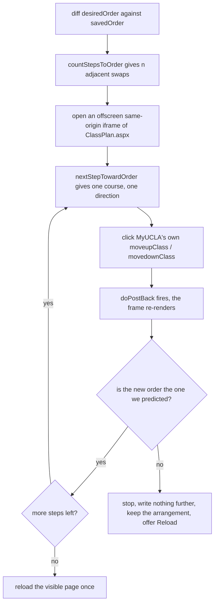

<div align="center">


# Better MyUCLA

**Browse courses beside your weekly schedule.**

An unofficial Chrome extension for the MyUCLA Class Planner.

[Install guide](site/index.html) ·
[v0.17.9 redesign prerelease](https://github.com/comet-ctrl/better-myucla-planner/releases/tag/v0.17.9) ·
[Contributing](CONTRIBUTING.md)

</div>



The optional workspace provides named destinations for My classes, Find classes,
Optimizer, Study list, Personal entries and Information & help. The original
calendar stays beside the selected module on desktop; narrower screens have a
Schedule switch. Original layout remains available.

MyUCLA moves a class one place per click, and every click is a full page
postback. Getting a class from 13th to 2nd costs eleven clicks and eleven page
loads. This makes it one drag.

Not made by, endorsed by, or affiliated with UCLA.

---

## What you get

|  | |
| --- | --- |
| **Drag to reorder** | Drop a class anywhere in the list. Drag to the top or bottom edge and the page scrolls with you. |
| **Send to the top** | Open a class's ⋯ menu and choose Move to top. |
| **Jump to a position** | Pick the spot you want out of a dropdown. |
| **Class notes** | In the class's ⋯ menu; 24 characters, kept on your own machine. |
| **Collapse** | Fold a class, or all of them. Native section statuses remain unchanged in the expanded table or workspace Details. |
| **Filter** | By course, instructor, page text, or your own note. |
| **Clash list** | Which classes each one collides with, in time or final exam, read from MyUCLA's own popover payload. |
| **Clearer search** | The original Search by selector and native fields remain visible, including UCLA's required selections and loading behavior. No automatic searches or extra course requests. |
| **My classes** | Per-section native status and meeting summaries; Details opens beside the list. Class actions exposes reorder and note tools. UCLA navigation, quarter selector and original plan actions remain available. |
| **Find classes** | Native search with a list of loaded courses beside the selected preview. Filter loaded titles/numbers locally; original controls and selections stay in the same form. |
| **Schedule** | Persistent beside the main workspace above 1100px; adjust its width with the divider or arrow keys. Below 1100px, the Schedule switch keeps the current module's state. |

Single-course results open directly without a duplicate index. When a selected
section is in another course preview, a small selection reminder lets you review
it without changing the native checkbox.

The pane layout remains a work in progress. [UI direction](docs/UI_DIRECTION.md)
describes the shipped design and the remaining limits of native search.

`docs/ROADMAP.md` has the rest, including the optional layout switch and the
things that were considered and declined.

## Preview the current build

Run `npm run build`, then `npm run preview:build`, and open
`site/workspace-preview.html` in Chrome. This self-contained preview imports the
production presentation modules and embeds the exact built stylesheet. Generation
checks shared source against the production source map and records build hashes.
`npm run preview:verify` checks the preview at desktop and phone widths.

Everything shown is fictional. Searches run locally over three sample courses;
account actions, saving, notes, drag and session features are unavailable. The
native calendar and secondary modules are fixture approximations. Production
origin guards are unchanged. The older `public/demo.html` remains a reordering
fixture, not a representation of the current workspace.

The repository includes the current preview in `site/`; it is not automatically
published from the `planner-redesign` branch. The Pages workflow deploys `main`.

---

## How it works

### It lives on exactly one page

```
https://be.my.ucla.edu/ClassPlanner/ClassPlan.aspx
```

That exact path is the whole of `content_scripts.matches` in the manifest, and
`storage` is the only permission. There is no background service worker, no
host permission beyond that URL, and no server behind any of it.

### Rearranging is local; saving is not

A drag reorders `<tbody>` nodes in your own DOM and stops there. Nothing is
sent, so you can try three arrangements and throw two away for free. The bottom
bar tracks the gap between two arrays: `savedOrder`, the order the server still
believes, and `desiredOrder`, the one on your screen.

Save is the moment those two get reconciled, and it does that using controls
you already had:



Two things fall out of that design.

**Why an offscreen frame.** Each move is an ASP.NET UpdatePanel postback that
re-renders the page. Eleven moves on the visible page means eleven reloads
under your cursor. The batch runs in a same-origin iframe of the same URL
instead, so the page you are looking at reloads once, at the end. Budgeted at
~1.2s per step, capped at 120 steps and a 15s load timeout per postback.

**Why clicking rather than posting.** The extension never composes a request of
its own. It finds MyUCLA's own `button.link.moveupClass` / `movedownClass`,
checks it against a whitelist, and clicks it. Every write is a thing you could
have done by hand, one confirmed click at a time.

### It fails closed

Before each click the button must pass every one of these, or the run stops:

- it is a `<button>` from that frame's own realm, and a descendant of the card
  it claims to move
- its id is exactly `muClass<digits>` / `mdClass<digits>` for that course, and
  its classes are `link` plus `moveupClass` / `movedownClass`
- `title` and `aria-label` both equal `Move this Class up in the list` for the
  direction being asked for
- its inline `onclick` matches the expected `courseListAction(...)` string
  character for character, including that same course number
- it has no `type` attribute, and no `formaction`, `formmethod` or
  `formenctype`
- `element.form` is `#aspnetForm`, whose method is POST and whose action
  resolves to this exact path
- it is visible and not disabled

After each click the resulting order must equal the order that was predicted
for that step. Any mismatch in page, term, plan id, DOM shape, button identity
or resulting order aborts immediately: nothing further is written, your
arrangement is kept, and a Reload button appears. There is no fuzzy fallback,
because a fuzzy match here moves the wrong class.

The full verified DOM contract is in [`docs/MYUCLA_CONTRACT.md`](docs/MYUCLA_CONTRACT.md).

### What it will not do

Enroll, drop, waitlist, exchange, or watch for open seats. Poll MyUCLA or send
any request of its own. Read or store passwords, cookies, tokens, UIDs, grades,
DARS, or Duo data. These are rules, not defaults; see [`AGENTS.md`](AGENTS.md).

---

## Build it

```bash
npm install
npm run typecheck && npm test && npm run build
```

esbuild bundles four entry points to IIFE, and `public/` is copied wholesale
into `dist/`. `dist/` is not committed. Load it in Chrome via
`chrome://extensions` → Developer mode → Load unpacked → `dist/`. After editing
source you must rebuild **and** press Reload on the extension card.

| Command | What it does |
| --- | --- |
| `node harness/run.mjs drag` | Drives the built extension against an invented Class Planner. Also `idle`, `position`, `top`, `default`, `tidy`. |
| `node harness/probe-position.mjs` | Asserts "move to #N" lands on N from every starting point. |
| `node harness/verify-install.mjs` | Walks the published install guide: zips `dist` the way the release workflow does, unzips, side-loads into a clean profile, checks the card and every injected control. |
| `node harness/chrome-extensions-page.mjs` | Retakes the `chrome://extensions` screenshots for the install guide. |
| `node harness/extension-card.mjs` | Retakes the extension-card screenshot. |
| `node scripts/make-icons.mjs` | Redraws all four icon sizes into `public/icons/`. |

The harness serves an invented fixture at the real URL through Playwright's
`page.route()`, so the content script's `matches` pattern fires without an
account and without touching a real plan. Screenshots land in `harness/shots/`.
**Never paste a real plan into the fixture.**

---

## Where things are written down

| Question | File |
| --- | --- |
| Architecture, seams, and traps already paid for | [`HANDOFF.md`](HANDOFF.md) |
| The verified MyUCLA DOM contract | [`docs/MYUCLA_CONTRACT.md`](docs/MYUCLA_CONTRACT.md) |
| State of play, open questions, what was declined | [`docs/ROADMAP.md`](docs/ROADMAP.md) |
| Where the Class Planner hurts, ranked | [`docs/PAIN_POINTS.md`](docs/PAIN_POINTS.md) |
| A product and UX read of the page | [`docs/UX_AUDIT.md`](docs/UX_AUDIT.md) |
| Version history and the reasoning per change | [`CHANGELOG.md`](CHANGELOG.md) |
| What may be stored and what may never be | [`PRIVACY.md`](PRIVACY.md) |
| Rules no change may break | [`AGENTS.md`](AGENTS.md) |
| How to propose a change | [`CONTRIBUTING.md`](CONTRIBUTING.md) |

Every version bump updates the status line below, adds a `CHANGELOG.md` entry,
and refreshes `HANDOFF.md` if the architecture moved.

**Status:** working local beta, `0.17.9` workspace redesign beta. Not on the Chrome Web Store.

The popup shows the installed version. Tidy remains opt-in. Named navigation
opens My classes, Find classes, Optimizer, Study list and Personal entries inside
the original MyUCLA page, while the weekly schedule remains alongside. Its divider
resizes with drag or arrow keys (Shift makes larger changes); double-click resets
it. Navigation becomes horizontal below 1280px. Below 1100px, Schedule switches
between the calendar and the workspace without losing their position.

Details open beside the class list while keeping native section controls inside
their original class row. Per-section summaries show meeting time and original
status text. The final-exam note expands separately. Close with × or Escape; focus
returns to the selected class. Other page controls remain interactive. Rooms and
instructors stay visible with each section, including during class selection.

For complete, already-rendered results, the browser lists course headings and
previews one course's native section rows at a time. Selection is local. Search
modes and fields stay visible; native checkboxes, submissions and handlers
remain in the original form. Unknown or incomplete results retain native controls.
MyUCLA still loads missing data through its explicit native searches: this does
not prefetch a catalog, bypass loading, or add background requests.

Optimizer, Study list and Personal entries retain their complete native modules.
The original plan actions remain under Plan actions, and Information & help
opens all original sidebar widgets. UCLA's original top navigation stays intact. The planner
introduction is compact: the original term selector appears beside the heading,
the explanation expands under About this planner, and term notices remain visible.
Information & help retains the original sidebar controls. Page
scrolling lets the unchanged UCLA banner scroll away and the planner use the freed
space. Compact header does this in one click while keeping the title, term and
notices visible. The choice is saved locally across terms, reloads and browser
tab changes; Show header brings UCLA's menu back and saves that choice. Keyboard
focus on the original menu releases compaction for access. Original layout restores
all six native section placements; turning Tidy
off restores presentation. Native section statuses and icons are unchanged.

v0.14.4 passed typecheck, 180 tests, build, fictional production layout checks
and GitHub CI. Live verification after reload confirmed Compact header / Show
header, retained title/term visibility, focus and all six modules.

After updating a build, reload the extension and refresh the planner. Run
`node harness/verify-workspace.mjs` against fictional data to check resizing,
result selection, native identity, dismissal, redraws, restoration, seven window
sizes, tall native headers and local panel dragging. Authorized live inspection
verified the pane controls, course previews, section expansion and Details.
v0.14.2 also prevents native BODY scrolling behind the workspace after searches,
keeping original UCLA navigation visible. The reloaded v0.14.2 build passed live
native search and section expansion with the header and term chooser on screen,
zero BODY scroll, native-form controls and Details bounds/focus intact.
v0.14.3 replaces the scroll lock with intentional document scrolling while BODY
remains non-scrollable. Fictional checks cover the compact introduction at five
widths, header scrolling in both directions, native redraws while scrolled,
Details bounds, sidebar reopening, notices and original-control restoration.
Authorized live v0.14.3 verification after reload passed the compact heading,
native term selector/notices, explanatory disclosure, all original sidebar widgets,
close/Escape/focus, scrolling away/back, Details bounds and a native search that
preserved the scrolled layout and native controls without horizontal overflow.

---

## License

MIT
