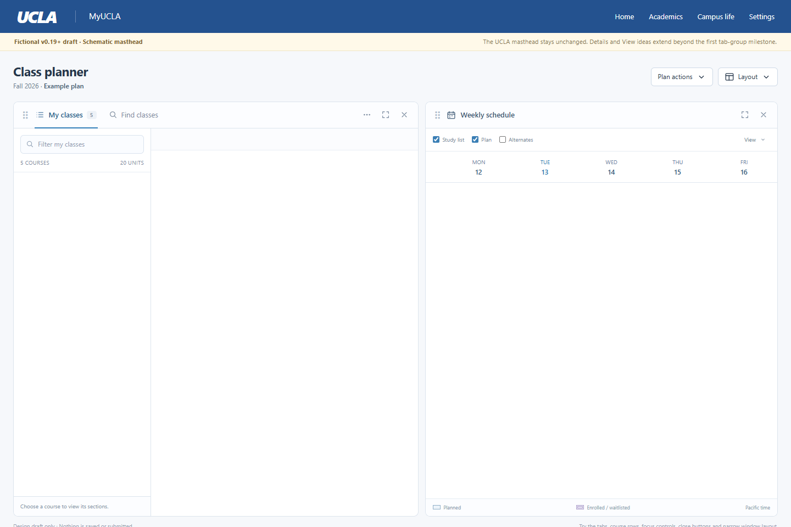

# v0.19 workspace

Development branch: `v0.19-workspace`. Saved baseline: `flexible-panels`, commit
`1337c94` (v0.18.6). This is a development milestone, not a published release.

## Problem

In the previous layout, opening Find classes while Schedule and My classes
occupied opposite edges could create a third, approximately 300px-wide pane.
Search and native sections then became difficult to read. Sidebar selection,
closing and floating also behaved like independent panels rather than familiar
tabs within a workspace.

## First milestone

- My classes and Find classes share a browsing group by default; Schedule has
  the other pane. Other native modules open as tabs through named navigation.
- One tab is active in each group. Switching retains native controls, their
  values and handlers, and scroll positions. Closed tabs can be reopened.
- A center drop merges a tab into a group; a permitted edge drop splits it.
  Preview and commit use the same operation. At most two docked groups display.
- Minimum useful widths prevent cramped splits. Narrow screens display one
  group at a time without overwriting the saved desktop arrangement.
- Floating remains an in-page singleton panel. Details keeps the existing
  multiple-course projection and its original course-row ancestry.
- Save public tab membership, order and active choices in
  `plannerLift.workspace.v2`. Read legacy v1 when necessary and preserve the
  old key for rollback. No course, account, search or enrollment data is saved.
- Default layout and Original layout retain their existing meanings. Native
  UCLA masthead, plan actions, statuses and enrollment workflows are unchanged.

## Design draft and later work

Open `harness/v019-design-draft.html` locally for an interactive fictional draft.
It explores a denser course index, a more structured details view and clearer
calendar typography after the group model works. It is not a replacement
website, a live MyUCLA page or a promise that the first milestone matches every
pixel. Its masthead is schematic; the extension must retain UCLA's masthead.

Course-list density, multi-course details navigation and calendar presentation
are follow-up passes. Keep rooms and instructors visible, preserve each
section's original status, and avoid adding redundant toolbars.

## Acceptance checks

- Switch Classes/Find without adding a third column or moving Schedule.
- Close active and inactive tabs, reopen, and retain remembered membership.
- Merge, split, float, resize and cancel; verify preview matches the committed
  bounds and cancellation does not save a transient layout.
- Restore in a fresh document and across native partial redraws. Restoration
  and Default layout must never invoke native disclosures or account actions.
- Check 2048, 1440, 1280, 960 and 390px, including collapsed navigation, local
  scrolling, keyboard selection, details focus and original control identity.
- Verify native status markup, original course-row parents, form association,
  calendar meeting geometry, printing and Original layout restoration.
- Run typecheck, unit tests, production build and fictional browser fixtures.
  Inspect the installed page separately before claiming live verification.

The installed v0.18.6 build stays in place while this milestone is developed.
